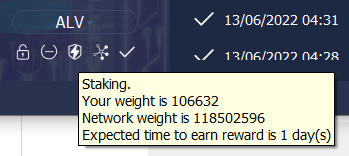
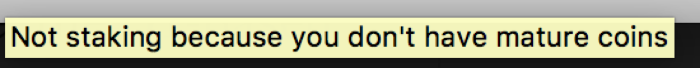
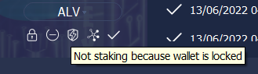

# Alvey Staking（PoS mining）Tutorial

Alvey employs PoS (Proof of Stake) consensus mechanism, which is different from Bitcoin's PoW (Proof of Work). The mining process in PoS system is called staking. The block producer will get 1ALVEY, as well as the transaction fees and gases as block reward. So the real reward is usually more than 1ALVEY in total.

**Alvey blocks are produced in average every 32s**

Basic requirements for staking：

1. Run a Alvey fullnode, and keep online (Since Alvey is using PoS, we don't need any mining machine, just PC or even Raspberry Pi can run a fullnode);
2. Have some ALVEY in the wallet (fullnode)（Any amount of ALVEY can be used for staking, more ALVEY means higher possibility to stake).

If you have no ALVEY yet, please get some from market before you doing following staking settings.

Currently, Alvey Core wallet is the only wallet that support Alvey PoS staking. Note that other wallets like mobile wallet and Alvey Electrum are not able to stake for the time being.

Two ways to stake:

* Method 1：Staking with alveyd, using command line, suitable for Linux/OSX/Windows/Raspberry Pi users who are familiar with command line tools.
* Method 2：Staking with `alvey-qt` wallet, with GUI, suitable for common users.

Either way works in the same way for staking, so you can choose either method you like.

## Method 1：Staking with `alveyd` (command line)

### 1. Run `alveyd`

To run `alveyd`, please refer to"[How to deploy Alvey node](../Guidance-of-Alvey-Deployment-and-RPC-Settings.md)".

Follow the guidance to run `alveyd`:

```
./alveyd -daemon
```

Staking is default on for alveyd, so no need for other options if you only want to stake.

### 2. Send some ALVEY to your wallet

First you can generate a new address with：

```
./alvey-cli getnewaddress
```

This will generate a new address with Prefix 'Q'. You can send some ALVEY to this new generated address for staking. You can generate as many addresses as you like, and send arbitrary ALVEY as you like for staking.

Note：**The coin should wait for 2000 blocks before being able to stake, i.e. about 17 hours to MATURE.**. 

After the Alvey node syncing to the latest block, you can check current balance with `./alvey-cli getbalance` or get utxo list with`./alvey-cli listunspent`。（[what is UTXO?](https://github.com/alveyproject/documents/blob/master/zh/Alvey-Blockchain-Guide.md#utxo账户模型)）。

Please do following steps after your coin is mature.

### 3. Check staking info

Check current staking info with：

```
./alvey-cli getstakinginfo
```

You might get the result like this：

```
{
  "enabled": true,
  "staking": true,
  "errors": "",
  "currentblocksize": 1000,
  "currentblocktx": 0,
  "pooledtx": 5,
  "difficulty": 5683612.564280176,
  "search-interval": 46,
  "weight": 53206430,
  "netstakeweight": 2278172497819029,
  "expectedtime": 5480654870
}
```

`enabled` means if your wallet have enabled staking, it should be true by default. `staking` means if your wallet is currently staking (mining). `weight` stands for the amount of ALVEY that is staking right now, with unit 10^-8ALVEY, here in the example, we have 0.532ALVEY staking. `expectedtime` stands for the expected time that you will get a reward, the unit is second.

### 4. How to stake if the wallet is encrypted？

If your wallet is not encrypted, you can skip this section. However, for security, we recommand you encrypt your wallet. ([How to encrypt?](../Encrypt-and-Unlock-Alvey-Wallet/README.md))

Alvey wallet can be encrypted with `encryptwallet`. However, staking will be stopped when it is encrypted. For example, `./alvey-cli getstakinginfo` for a encrypted wallet：

```
{
  "enabled": true,
  "staking": false,
  "errors": "",
  "currentblocksize": 1000,
  "currentblocktx": 0,
  "pooledtx": 94,
  "difficulty": 5788429.670171153,
  "search-interval": 0,
  "weight": 53206430,
  "netstakeweight": 2438496688951881,
  "expectedtime": 0
}
```

See `staking` turns to `false`, which means wallet is not staking.

You can use `walletpassphrase` to unlock wallet for staking：

```
./alvey-cli walletpassphrase "<your passphrase>" 99999999 true
```

The meaning of the arguments can be found in the documents "[How to encrypt?](../Encrypt-and-Unlock-Alvey-Wallet/README.md)".

After unlocking, you can double check `getstakinginfo`, it should look the same with previous unlocked result, `staking` become true.

## Method 2: Staking with alvey-qt wallet (official PC wallet)

How to use Alvey-qt tutorial? please refer to [Alvey qt wallet tutorial](../Alvey-Wallet-Tutorial/README.md). Current supported platform: Mac/Linux/Windows.

### 1. Open Alvey qt wallet

Launch the wallet.

### 2. Send some ALVEY to your wallet

If you already have some ALVEY in your wallet, you might skip this step.

If not, please send some ALVEY to your wallet first. ([How to receive?](../Alvey-Wallet-Tutorial/README.md)).

Note：**The coin should wait for 2000 blocks before being able to stake, i.e. about 17 hours to MATURE.**. 

### 3. Check staking status

The flash sign at the bottom of wallet shows staking info :

**Solid black flash means it is staking now**. For more information, you can put your mouse on the flash, e.g.:



* `Staking`: if it is staking；
* `Your weight is`: How many ALVEY are able to used for staking, unit is ALVEY;
* `Network weight is`: How many ALVEY are staking in the network, unit is ALVEY；
* `Expected time`: expected time to get reward, unit is Day.

**Hollow flash measn it is not staking**

Possible reasons for not staking：

* 1.There is no coins of no mature coins (more than 2000 confirmations(blocks)) -- Solution: send some ALVEY to the wallet and wait for 2000 blocks (about 17 hours);



* 2.Wallet is locked/encrypted -- Solution: unlock the wallet for staking. ([How to unlock?](../Encrypt-and-Unlock-Alvey-Wallet/README.md))



**No flash sign means staking is disabled**

* 3.Staking is disabled -- Solution: enable staking in the alvey.conf (-staking=true)([How to set alvey.conf？](../Guidance-of-Alvey-Deployment-and-RPC-Settings.md))


## About block reward

The block producer will get more than 4ALVEY rewards, something to keep in mind:

* The reward come from a new transaction, you can check balance to see if you get the reward.
* Once succesfully stake, you will get 1ALVEY reward immediately.
* The staked coins (UTXO) will be locked for 2000 blocks, during this period, it cannot be spent nor be used to stake. 

## How to disable staking?

Staking is by default enabled for Alvey wallet. If you need to disable staking for some reason (for example exchanges are always recommanded to disable staking), you might following anyone of the 3 ways below:

1 Add `-staking=false` when running Alvey node：

```
./alveyd -staking=false -daemon
```

For qt wallet, it is like：

```
./alvey-qt -staking=false
```

2 Add config `staking=false` in alvey.conf;([How to set alvey.conf？](../Guidance-of-Alvey-Deployment-and-RPC-Settings.md))

3 Encrypt wallet, since encrypted wallet will automatically stop staking.([How to unlock?](../Encrypt-and-Unlock-Alvey-Wallet/README.md))