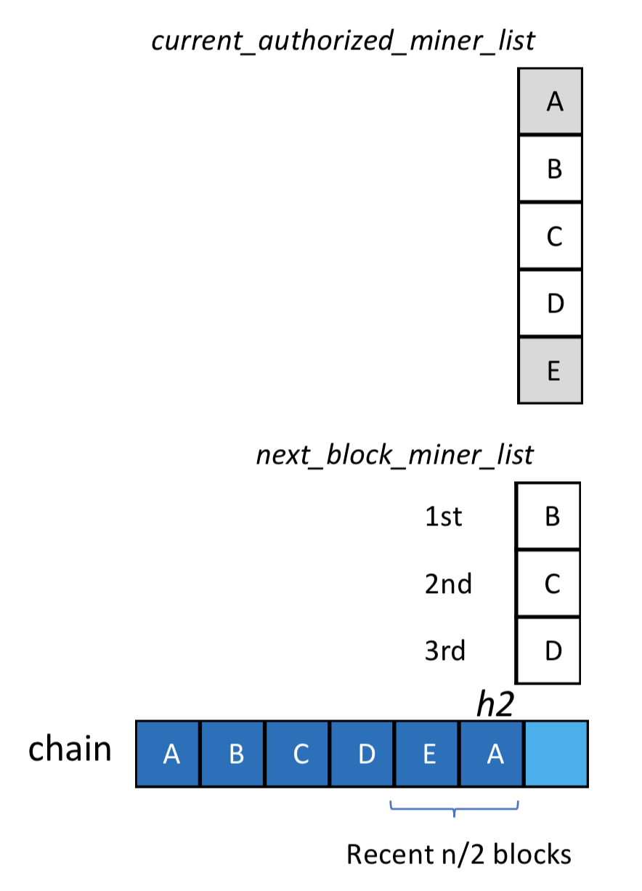
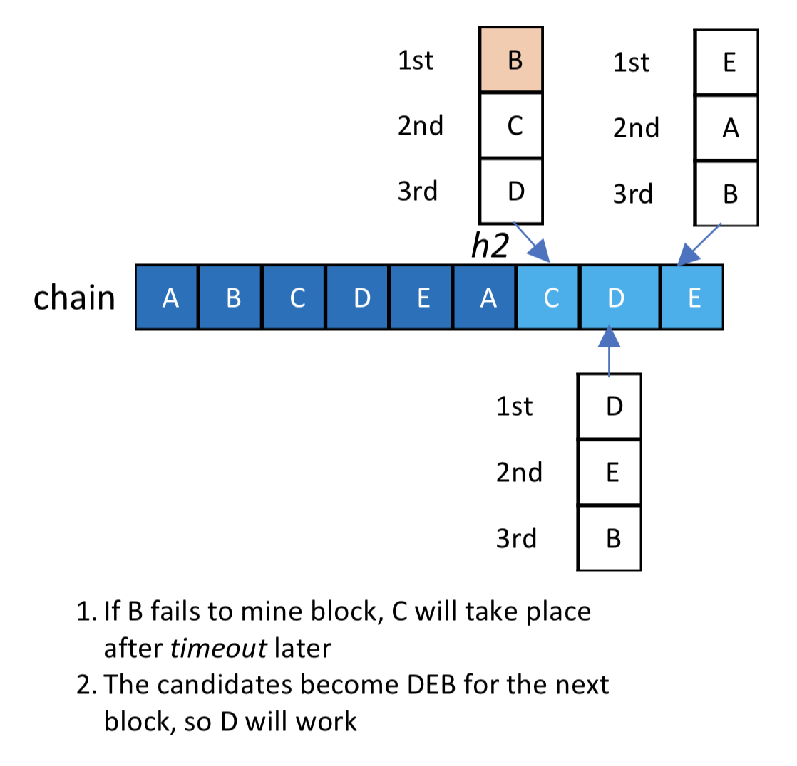

# Technical White Paper for AlveyX

# Background

The Alvey Enterprise version, named AlveyX, aims to develop a consortium blockchain, in which the consensus process is executed by a small group of authorized nodes, whereas the right to read and create transactions is still public.

This version will be built on the basis of the Alvey framework, which has proved to be a successful public blockchain. New modules are introduced to meet the following enterprise requirements:

1.  High TPS (Transactions Per Second) and short confirmation time. 
2.  Customizable settings for using in various usage scenarios.

# Consensus Algorithm

## Consortium Blockchain and Proof of Authority

Blockchains like Bitcoin, Ethereum and Alvey are called public blockchains. They have no access restriction. Anyone can send transactions to them as well as participate in the block creation process. In these cases, many consensus algorithms are developed, such as PoW (Proof of Work) and PoS (Proof of Stake), allowing a large number of users to reach a consensus about who can mine new blocks. These blockchains are generally considered to be fully decentralized.

A consortium blockchain is often said to be partially decentralized, where the consensus process is executed by a small group of authorized nodes. For example, a consortium of three game companies plan to launch a blockchain with cryptocurrencies which can be spent in their games. Each of them runs a node to verify transactions and mine blocks. Game players, however, only have access to reading blocks and sending transactions. In this situation, just the three authorized nodes need to reach a consensus on block producing.

For consortium blockchains, the consensus algorithm is usually called PoA (Proof of Authority). Instead of solving a difficult mathematical problem in PoW or holding a large amount of cryptocurrencies in PoS, in PoA, a list of authorized block miners is used to determine which nodes are allowed to create new blocks. The chain has to be signed by the majority of miners, then it becomes a permanent record. It is more efficient and secure since the miners are fewer and more reliable.

## A BFT type Consensus Algorithm
Here we introduce a PoA consensus algorithm which will be available in the Alvey Enterprise version. It is a BFT (Byzantine Fault Tolerance) type algorithm and is always addressed as the signed-message solution to the Byzantine Generals' Problem [1]. Each block has to be signed by its miner and the system stops producing new blocks only when half or more than half of the authorized nodes are down. We illustrate the entire algorithm here first and describe it in detail in the following paragraphs.

To help explain this algorithm we assume there are 5 authorized block miners, A, B, C, D, E. Their public keys are stored in an ordered list. This list is initialized at the very beginning of the blockchain and can be updated later by a smart contract. So we suppose that, at block height *h1*, the *current_authorized_miner_list* is *[pubkey_A, pubkey_B, pubkey_C, pubkey_D, pubkey_E]*
. Then these 5 block miners will take turns producing a new block, from height *h1* to *h2*, like the illustration below.

When producing a new block, the miner has to use the *secp256k1_ecdsa_sign_recoverable* function to sign the block and then add the output signature to the block. By this way, other nodes can recover the miner's public key from the signature by using the function *secp256k1_ecdsa_recover*, and then verify its authority through the *current_authorized_miner_list*.

The chain which is signed by the majority of authorized miners can be regarded as a permanent record. For example, in the illustration above, the blockchain from the genesis to the height of *h3* is permanent, since it has been verified and signed by its following block miners D, E and A. If anyone tries to create a fork at a height lower than *h3*, it will never be followed by the majority of authorized miners.

Therefore, at least *n/2+1* miners are needed to keep the algorithm working, where *n* is the total number of authorized block miners and *n/2* is a integer division. In our example *n=5*, so at least 3 nodes are need. That is, nodes A, B, C can continue to mine new blocks when D, E are shutdown. The output blockchain, which would be like ABCABC, is valid. This consensus algorithm can be simply defined as follows:

> One miner can mine the next block when:
> 1.    It is currently authorized.
> 2.    Recent n/2 blocks are not mined by it. 

By this definition, we are able to obtain the miners which are actually allowed to mine the next block. It simply requires removing miners of the recent *n/2* blocks from the *current_authorized_miner_list*. For example, at the height *h2*, the *next_block_miner_list* can be calculated as.

Although B, C, D all can mine the next block, a priority order should be specified for them, so as to avoid their competition for the next block and ensure the blockchain would be verified by as many miners as possible. Therefore, we define the *next_block_miner_list* as an ordered list, where the miner next to the current block miner in *current_authorized_miner_list* is supposed to be at the first place, and so on. In our example, the order of B, C, E is shown in the illustration above.

When the priority order is determined, the *block_time* for each miner is calculated afterwards. The miner with a higher order in the *next_block_miner_list* is assigned an earlier *block_time*. Each miner uses the assigned *block_time* to create a new block and keeps waiting until the *block_time*. If no block is received during the waiting, the miner will then broadcast its block. The calculation of *block_time* is illustrated as:

In this way, if one node fails to mine a block, the next miner will take place after *timeout* later. Here is an example. Node B is down when producing the block at height *h2+1*. Then node C, which is next to B in *next_block_miner_list*, will broadcast its block *interval+timeout* after *parent_block_time*.

## DGP for Authorities Storage and Update
DGP (Decentralized Governance Protocol) [2] is a technology used in Alvey, which allows blockchain parameters to be modified through a specially designed smart contract on the blockchain, without any disruption to the ecosystem like soft or hard forks.

The way the DGP works is relatively straightforward. First, a governing party for the DGP makes a proposal to change a parameter. Afterward, all the governing parties for the DGP can vote on the proposal, and if it receives enough approval votes, then the parameter change proposal becomes active. The proposal data is then placed in a standardized format and a particular storage space so that the blockchain software can easily access it without needing to execute the DGP contract directly.

Obviously, the DGP is also a suitable method for the storage and update of the authorized block miners in PoA. The miners, actually a list of public keys, can be initialized by a config file and then updated by the DGP. But here we should make a little modification to the DGP so that the update process can be more secure.

> The new miner list activated by the DGP should take effect a few blocks later, when the activation is verified and signed by *n/2+1* miners of the previous list. 

Here, *n* is the length of the previous list and *n/2* represents a integer division. This mechanism ensures that the update process takes effect when it becomes a permanent record in the blockchain. Otherwise, if the update process can be denied by another fork, it is possible for those previous miners to work on that fork and even cause a hard fork afterwards.

## Block Reward
Different from the coinstake in PoS, block miners of PoA are rewarded in the coinbase for simplicity. The contract refund, which is generated by the contract execution in Alvey, should be added to the coinbase as well. Therefore, the coinbase in PoA contains one or more outputs. The first one is paid to the block miner and its amount equals to the sum of transaction fees and block subsidy, while others are contract refund outputs.

# Customizable Settings
We will try to make most parameters configurable in the Enterprise version. So that the system can be easily applied to various usage scenarios. Some customizable settings are listed as follows:

1.  The genesis block: *block_time*, coinbase.
2.  Network parameters: *pchMessageStart*, *seeds*.
3.  Parameters for the PoA consensus algorithm: *interval*, *timeout*.
4.  Block reward parameters: initial value, *nSubsidyHalvingInterval*

# Applications

The best way to describe the value of AlveyX is to take a look at its applications. Here we will show 3 usage scenarios of AlveyX. More applications need to be discovered in the future when we actually use it.

## Token-based Applications
As a blockchain system, one basic application is the token. With AlveyX, you can easily build a system for the storage and exchange of tokens. Here the term "token" can be:

1.  Gold coins in internet games
2.  Gift card distributed by supermarkets
3.  Air miles got from airlines

These usage scenarios demand several features, like high TPS, fast confirmation and thin client. All these features are supported in AlveyX.

## Smart-contract-based Applications
Smart contract based applications are also worth expecting. You can transform written contracts or rules into smart contracts of AlveyX. By this way, the contract will be transparent, unmodifiable and easy to verify. Using a consortium blockchain to deploy smart contracts has several advantages. The most important one is that the developer only need to run some miner nodes for the blockchain, rather than consume public blockchain tokens which are really expensive.

Here are some smart contract based applications:
1.  Prediction markets
2.  Insurance, like car insurance and property insurance
3.  Sales and lease of real estate
4.  Games

## Digital Identity
Digital identity means recording some important information in blockchain so that it can be verified and tracked by the public. Using a consortium blockchain to do this can also save money when compared to a public blockchain. Usage scenarios can be:

1.  Supply chain management: track products from the producer to the retailer
2.  Education records: record education experience or online courses experience
3. Luxury: record information of luxury for public verification

# Future Work
The AlveyX project aims to build a business solution, helping enterprises, organizations and schools to apply the blockchain technology to their areas. So it will be more than a consortium blockchain proposed in this paper. More information about AlveyX will be published after we applied the patents related.

# References

[1] Driscoll, Kevin; Hall, Brendan; Sivencrona, Håkan; Zumsteg, Phil. "Byzantine Fault Tolerance, from Theory to Reality". 

[2] [alveychain.com](https://alveychain.com/en/blog/alvey-s-decentralized-governance-protocol). "Alvey's Decentralized Governance Protocol". 