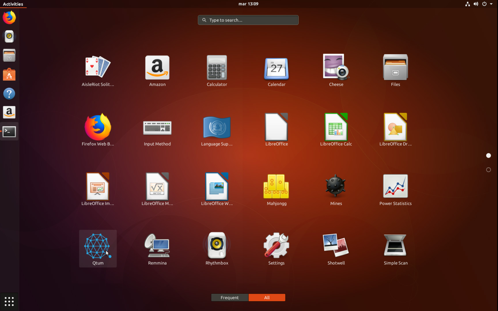
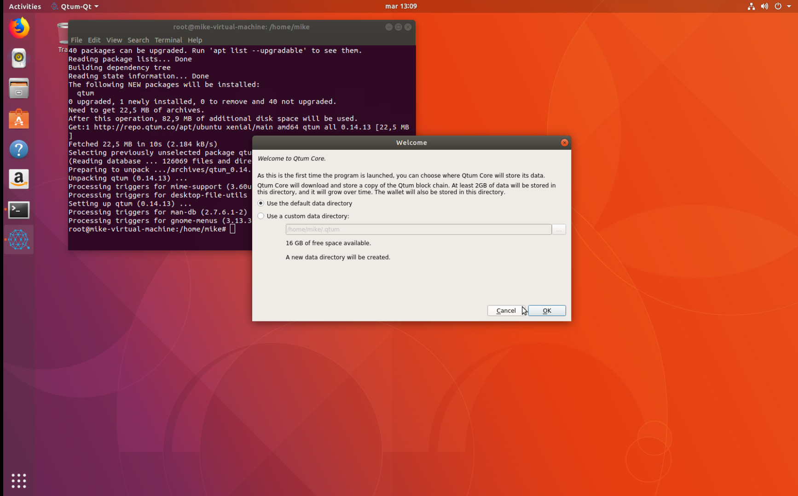

# Como utilizar los repositorios oficiales de ALVEY para Ubuntu 16.04-18.10, Debian y Archlinux.


Hemos publicado nuestro repositorio oficial de Alvey en https://repo.alveyscan.com este repositorio soporta las siguientes distribuciones:

### Debian

- 8.x (Jessie)
- 9.x (stretch)
- Testing (Buster)
- Unstable (Sid)

### Ubuntu 

16.04 - 18.10

### Mint 

18.x

### Archlinux

[Obtenlo mediante AUR](https://aur.archlinux.org/packages/alvey/) 

### Enfoque de este documento

Este tutorial asume que ud tiene un conocimiento basico de Linux y manejo de terminal, todo el proceso utiliza el terminal de Linux.

# Instalando en Ubuntu

### Descargar la llave publica

Primero, debemos descargar la llave publica de Alvey del servidor de llaves de Ubuntu:

`sudo apt-key adv --keyserver keyserver.ubuntu.com --recv-keys  BF5B197D`

Esto descargara y agregara la llave de Alvey a tu Linux.

### Agregar el repositorio de Alvey a tu lista APT

`sudo su` - Obten permisos de administrador

` echo "deb https://repo.alveyscan.com/apt/ubuntu/ xenial main" >> /etc/apt/sources.list.d/alvey.list`

Esto agregara el repositorio a tu lista de APT. **NOTA:** Por favor recuerda cambiar "xenial" por el nombre codigo de Ubuntu.  <!--(Por ejemplo, Ubuntu 17.10 nombre codigo es artful, en este caso, tu tienes que reemplazar xenial por artful)-->

### Actualizando las fuentes APT e instalar Alvey

`sudo apt update && sudo apt install alvey`

Al hacer esto, actualizaremos las fuentes e instalaremos Alvey en nuestro Ubuntu.

## Instalar en Debian

Descargar la llave publica de Alvey en Debian es un poco diferente pero no complicado.

```wget -qO - https://repo.alveyscan.com/apt/public.key | sudo apt-key add - ```

Esto descarga e instala la llave publica de Alvey


### Agregar el repositorio de Alvey a tu lista APT

`sudo su` - Obten permisos de administrador

` echo "deb https://repo.alveyscan.com/apt/debian/ stretch main" >> /etc/apt/sources.list`

Esto agregara el repositorio a tu lista de APT. **NOTA:** Por favor recuerda cambiar "stretch" por el nombre codigo de Debian.  <!--(Por ejemplo, Debian 8 nombre codigo es jessie, en este caso, tu tienes que reemplazar stretch por jessie)-->

### Actualizando las fuentes APT e instalar Alvey

`sudo apt update && sudo apt install alvey`

Al hacer esto, actualizaremos nuestras fuentes e instalaremos Alvey en nuestro Debian.

### Iniciando Alvey

Iniciar Alvey es sencillo, simplemente vamos a nuestro menu de aplicaciones y buscamos a Alvey







Ya podemos abrir nuestra billetera y comenzar a sincronizar!
